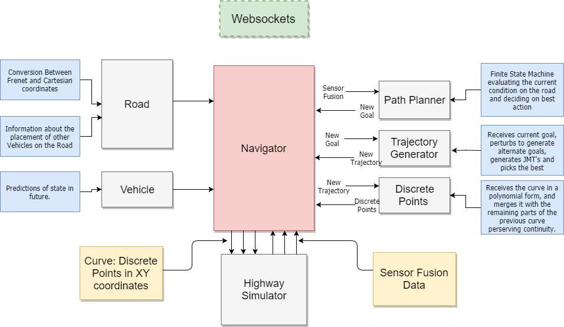

arND Path Planning Project
==========================

Introduction
------------

This project implements a path planner, that creates smooth safe paths  
for autonomous vehicles along a highway with mild or heavy traffic. The
highway and the real time data are provided to the planner by [Udacity's
simulator](https://github.com/udacity/self-driving-car-sim/releases).

The simulator communicates with the planner via WebSocket interface and
provides real time information including

* Vehicle's current position in **Cartesian** coordinates
* Vehicle's current position in **Frenet** coordinates
* Vehicle's speed and yaw
* A list of points from the previous path provided by the planner that
  have not been "consumed" yet.
* **Sensor fusion** data for other vehicles on the same side of the
  road.

On the planner side, it uses those information to create a set of
discrete points in Cartesian coordinates that will be consumed by the
simulator. Consumption is done by "moving" the vehicle to the point we
provide, using a point every 0.02 seconds (50 Frames per second). The
simulator does not drive the car from point A to point B but "teleports"
the vehicle from position A to position B.

The car should move respecting certain limits of Speed, Acceleration and Jerk.

Navigator Architecture
----------------------

The architecture is described in the following diagram:



The Websocket interface enables communication layer between the
Simulator and path planner. The communication is in main.cpp. The link
between the Navigator and WebSockets interface is kept as simple as one
line of code

``` c++
// line:64
auto msg = "42[\"control\"," + navigator(j) + "]";
```

Simply overloading the () operator on the Navigator struct and passing
the json object containing the new sensor fusion data.

## The Navigator Struct

The whole path planning cycle is very self explanatory in the code
itself and is documented well enough. Pasting here for reference

``` c++
 // 1. Update or pass
  car.readPreviousPath(json); // reads previous path, end_path data
  if (!plan.shouldUpdate()) { return car.previousCurve.toJson(); }

  //  2. Update data and calculate local data
  car.updateData(json, 1, true);
  car.updateLocalData(road.orientation(car.s));
  plan.reportedLag = car.lag();
  road.updateData(json);

  // 3. Create new goal
  auto newMode = plan.select_mode(car, road);
  car.mode = newMode;
  auto newGoal = plan.realizePlan(newMode, car, road);

  // 4. Generate new trajectory
  auto trajectory = tr_generator.generateTrajectory(newGoal, car, road);

  // 5. Keep the final plan for next starting state
  car.currentGoal = trajectory.goal;

  // 6. Create new discrete curve
  auto numberOfPoints = (int) (road.rcfg.frames * newGoal.duration);
  auto newCurve = std::move(curveHandler.createCurve(trajectory, road, numberOfPoints));

  // 7. Merge with previous curve
  auto mergedCurve = curveHandler.appendCurve(newCurve, car.previousCurve);

  return mergedCurve.toJson();
```

## The Behavior Planner

The behavior planner is a simple finite state machine. For each state,
we define possible next states. Each of them is evaluated and
"quantized". The state with the least cost is selected as the next
state. The next state is to realize the plan, by creating an end state
as a goal, based on the current position (or expected position) of the
vehicle and it sensor fusion data. The goal, encapsulated in a StateGoal
struct is passed to the trajectory generator to create the actual
continuous path from start state to end state.

The states of the FSM are described in the following simple map object.

```c++
map<string, vector<string>> Planner::next_modes = {
    {"KL", {"EB", "MF", "KL", "LCL", "LCR"}},
    {"MF", {"EB", "MF", "KL", "LCL", "LCR"}},
    {"EB", {"EB", "MF", "LCL", "LCR"}},
    {"LCL", {"KL"}},
    {"LCR", {"KL"}},
    {"OFF", {"ON"}},
    {"ON", {"KL", "MF", "LCL", "LCR"}}
};
// KL : KEEL LANE
// MF : MATCH FRONT VEHICLE SPEED
// EB : EMERGENCY BREAK (for cars suddenly getting in my way)
// LCL & LCR : CHANGING LANES 
// OFF: THE INITIAL STATE
// ON: STARTING THE ENGINE. INITIALIZING
```


## Trajectory Generator

Trajectory Generator takes the goal generated by the behavior planner,
creates alternate goals, by perturbing the initial plan to create
similar to the original plan, and then generate JMT (jerk minimized
trajectories) polynomials that are evaluated against certain parameters,
such as collision with other vehicles (in every point of the path),
exceeding limits for velocity, acceleration, jerk and positions (s and
d) and finally selecting the best one to be digitized and send back to
the simulator


## Discrete curves generator

Receives the polynomials from the Trajectory generator, creates a
discrete set of points equidistant (as the simulator prescribes) and
merges the curve with the curve send us back by the simulator, which are
just the points that have not yet been consumed by simulator.

Our task here is to create a smooth curve preserving continuity not only
in the graph, but also in the first order (velocity) and second order
derivatives.

The final result (set of points) is sent back to the simulator

## Thoughts on the project

The project had many small and big problems to solve. Some of the early
decisions made when programming the project affect the way you can
handle things later.

* How to handle the Frenet to Cartesian conversion is one problem. One
  may choose to completely work on Cartesian coordinates, using the cars
  local coordinate system. The **big** benefit of this decision is that
  although you work on on linear paths, you are dealing with real
  lengths and real velocities, which the Frenet system hides from you

* I choose to work with a pre generated approximation (by splines) of
  the track, but also a "on the fly" generation of a local coordinate
  system is possible (and actually implemented). I choose to keep in the
  final code the one that is calculated once before the start of the
  simulation, off loading the planner from the extra repeated
  calculation of splines.
* My initial selection was to work on the goal state space consisting of
  (position, velocity, acceleration). In hindsight, I would choose to
  include the jerk component there too. The problem of leaving it out,
  is that although i can enforce continuity in acceleration values ,
  there is no way to enforce continuity in derivatives of accelerations,
  so have no control on the magnitude of jerk.
* The above choice forced me to require acceleration to be zero at goal
  endpoints, thus minimizing the danger of jerk, but loosing performance
  since the car was to start from zero acceleration, accelerate and move
  back to zero acceleration every cycle.
* How you combine previous curve with next curve, was a very big problem
  for me. In the beginning I wanted to merge the two curves at a point
  of my choice, but enforcing continuity in derivatives is very hard.
  You can try smoothing the resulting curve, and nugging points to
  create a smooth result, but its very fragile and car easily be broken.
* A possible solution to this was to create another JMT curve, joining
  the start and end state, but the big problem here is that there is no
  guarantee that this is actually a function (meaning, that at the edge
  of the road we can have points with the same X's and different Y's.
  Maybe its very rare, but I thought it was dangerous to spend much time there.
* A viable solution would be to treat the problem as a Ipopt (interior
  position optimizer problem) and use a solver to do the work. It was a
  completely viable solution but I thought It was a bit like "cheating"

## Limitation and possible enhancements

The project is far from perfect and can be improved in many ways. Some
limitations are

* Although it recognizes possible collisions (other cars running onto
  it) it does nothing about it. The main reason about that is , as
  mentioned above, the decision not to include the jerk in the goal
  state. As of that the perturbations cannot go wildly of the initial
  goal without breaking the jerk (and acceleration) restrictions.
* There are some rare incidents of accidents happening in the opposite
  lane and cars ending on the other side of the road. Those cannot be
  avoided since there are no sensor fusion data for that side of the road.
* The vehicle is very conservative in overtaking requiring the vehicle
  in the adjacent lane to be far enough to make the change. To improve
  that it needs another state to match or better the trailing vehicle's
  speed and of course let accelerations be non zero and end states for
  the car to have enough acceleration to overtake.

## Dependencies

* cmake >= 3.5 [click here for installation instructions](https://cmake.org/install/)
* make >= 4.1
* gcc/g++ >= 5.4 (Linux & Mac)
* Visual C++ (Windows)
* [uWebSockets v.14+](https://github.com/uWebSockets/uWebSockets)
  * Run either  `install-mac.sh` or `install-ubuntu.sh`. (Linux & Mac)
  * Install [vcpkg](https://github.com/Microsoft/vcpkg) and then install
    uWebsockets using 'vcpkg install uWebsockets`
  * If you need to run on a earlier webSockets version you need to
    change in the main file the pointer `*ws` to simply `ws` and change
    the three send commands from `ws->send` to `ws.send`
* Udacity's Simulator. Latest version
  [here](https://github.com/udacity/self-driving-car-sim/releases/tag/T3_v1.2).

## Build Instructions

* clone repository
* Linux
  * mkdir build & cd build
  * cmake  .. && make
* Windows
  * Use Visual C++ compiler community edition (MinGW has some problems
    with uWebSockets)

